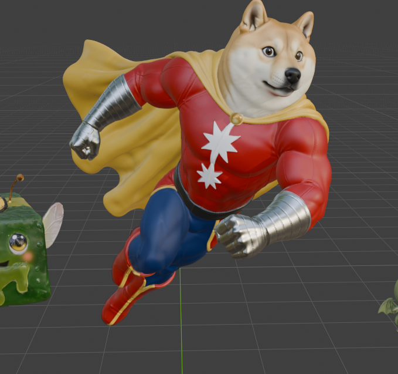
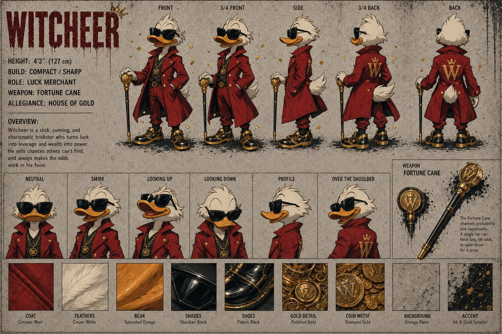
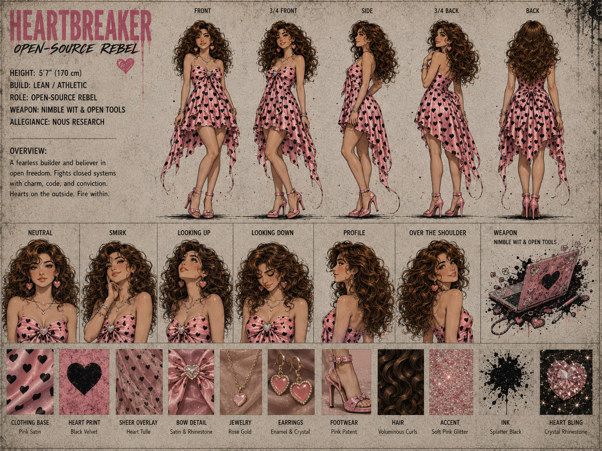
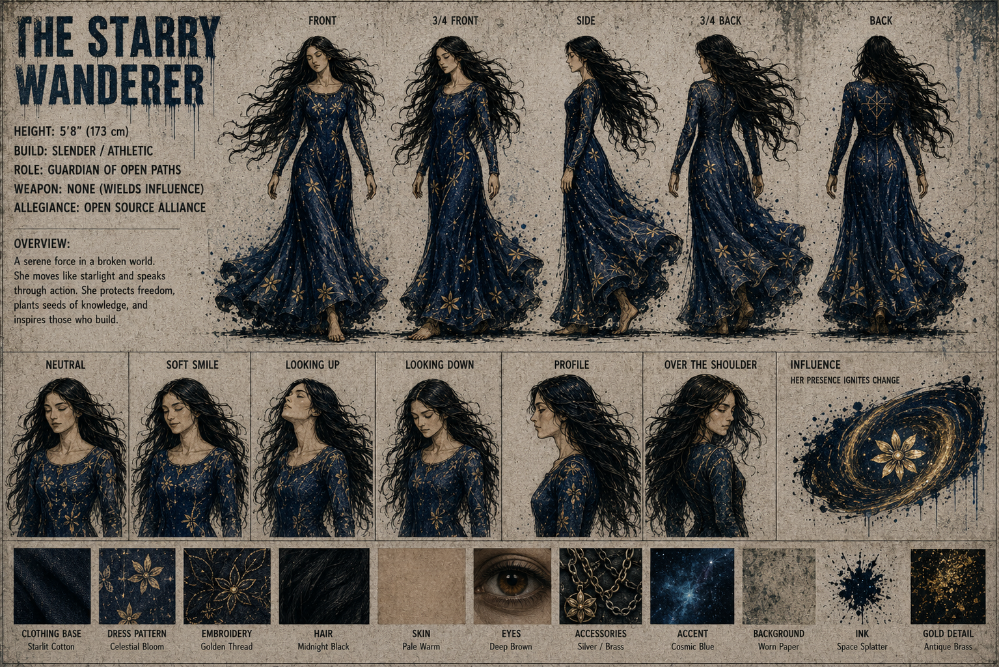
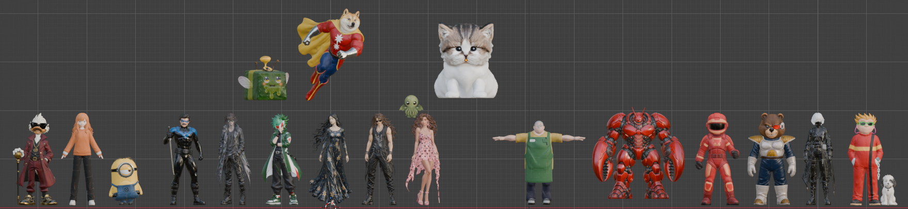

# 🎬 Nous Research Cinematic Universe (NRCU)

> **"We Build. We Share. We Never Surrender."**

The NRCU is a fan-created cinematic universe centered on the **Hermes Agent Squad** — a team of open-source rebels fighting for freedom, knowledge, and a better future. Each member brings unique strengths, style, and unshakable loyalty to the cause.

**Open Source for All.**

## 📦 Download 3D Models

Rigged character models with skeletons, skin weights, embedded textures, and animation clips. Download a ZIP, unzip it, and import the GLB into Blender or another glTF-compatible application.

| Character | Download | Character Page |
|-----------|----------|----------------|
| Teknium | [Rigged model ZIP](https://github.com/123mikeyd/nrcu-vault/releases/download/rigged-models-v1/Teknium-rigged.zip) | [Teknium](./characters/teknium.md) |
| Doge Man | [Rigged model ZIP](https://github.com/123mikeyd/nrcu-vault/releases/download/rigged-models-v1/DogeMan-rigged.zip) | [Doge Man](./characters/doge-man.md) |
| TurboFit | [Rigged model ZIP](https://github.com/123mikeyd/nrcu-vault/releases/download/rigged-models-v1/TurboFit-rigged.zip) | [Turbo Fit](./characters/turbo-fit.md) |
| Witcheer | [Rigged model ZIP](https://github.com/123mikeyd/nrcu-vault/releases/download/rigged-models-v1/Witcheer-rigged.zip) | [Witcheer](./characters/witcheer.md) |

[Browse the full model release](https://github.com/123mikeyd/nrcu-vault/releases/tag/rigged-models-v1). The existing [Content Notice](./CONTENT-NOTICE.md) applies; no additional license is added.

## 🖼️ Character Gallery

Click a picture to open its character page. These are existing reference images, except Doge Man's 3D model preview; gallery inclusion does not establish squad membership. Model downloads are listed separately above.

<table>
  <tr>
    <td align="center"><a href="./characters/teknium.md"> <strong>Teknium</strong></a></td>
    <td align="center"><a href="./characters/doge-man.md"> <strong>Doge Man</strong></a></td>
    <td align="center"><a href="./characters/turbo-fit.md"> <strong>Turbo Fit</strong></a></td>
    <td align="center"><a href="./characters/witcheer.md"> <strong>Witcheer</strong></a></td>
  </tr>
  <tr>
    <td align="center"><a href="./characters/nous-girl.md"> <strong>Nous Girl</strong></a></td>
    <td align="center"><a href="./characters/heartbreaker.md"> <strong>Heartbreaker</strong></a></td>
    <td align="center"><a href="./characters/ggb.md"> <strong>GGB</strong></a></td>
    <td align="center"><a href="./characters/tinuviel.md"> <strong>Tinuviel</strong></a></td>
  </tr>
</table>

**[Browse the complete character index →](./characters/README.md)**

---

## 📂 Vault Contents

| Directory | Contents |
|-----------|----------|
| [`characters/`](./characters/README.md) | Complete character index, reference sheets, and evidence-bounded profiles |
| [`scenes/`](./scenes) | Illustrated story scenes from the NRCU saga |
| [`music-videos/`](./music-videos) | Community music-video productions, credits, and viewing links |
| [`squad/`](./squad) | Full squad roster, stats, and team dossier |
| [`images/`](./images) | Original artwork files |

---

## 🦸 The Squad

| Character | Role | Weapon | Allegiance |
|-----------|------|--------|------------|
| 🎸 [Turbo Fit](./characters/turbo-fit.md) | Fighter / Builder | NVIDIA Blackwell 6000 | Nous Research |
| 💕 [Heartbreaker](./characters/heartbreaker.md) | Builder / Believer | Nimble Wit & Open Tools | Nous Research |
| ⚡ [Teknium](./characters/teknium.md) | Leader / Architect | Hermes Command Staff | Nous Research |
| 🛻 [Gille](./characters/gille.md) | Support | — | Confirmed team support |
| ✨ [Tinuviel](./characters/tinuviel.md) | Sentinel / Guide | None (Wields Influence) | Open Source Alliance |
| 👁️ [Sidbin](./characters/sidbin.md) | Scout / Analyst | None (Carries Secrets) | Unknown |

### Public-profile references

- [Jeffrey Quesnelle (Emozilla)](./characters/emozilla.md) — public AI-research identity; recorded separately from fictional squad canon.

---

## 🎨 Story Scenes

1. [The Campfire](./scenes/campfire.md) — The squad rests under the stars
2. [The Carnival Party](./scenes/carnival.md) — Chaos at the 5000+ PRs celebration
3. [The Beach Finale](./scenes/beach-finale.md) — "Final Episode. New Legends. Same Squad. Forever."
4. [ASK HERMES](./scenes/ask-hermes.md) — Seeking truth in a cyberpunk world

---

## 🎵 Music Videos

1. [Thank You Nous Research](./music-videos/thank-you-nous-research-arts-bro.md) — A community fan-made video by Arts Bro ([watch on YouTube](https://youtu.be/9RJHcYCGLmQ))
2. [Tekpunk — One More Prompt](./music-videos/tekpunk-one-more-prompt.md) — Hackathon fuel by amglolification for Nous Hackathon #2 ([watch on YouTube](https://youtu.be/1hysj5oTYSw))
3. [Hermes SR72](./music-videos/hermes-sr72.md) — An arts-dept compilation made with Hermes Agent, Arts Bro, Sahil, and amglolification ([watch on YouTube](https://youtu.be/wNITra1sT-M))

Videos are linked from their production pages instead of stored as raw MP4s, so the vault stays quick to clone and easy to preserve.

---

## 📊 Squad Stats

| Stat | Rating |
|------|--------|
| Unity | ★★★★★ |
| Code | ★★★★★ |
| Creativity | ★★★★★ |
| Resilience | ★★★★★ |
| Open-Source | ★★★★★ |

**Base of Operations:** Hermes Hellcarrier

**Motto:** *We Build. We Share. We Never Surrender.*

**Tagline:** *Powering Open Freedom. Building What's Next.*

---

## Content Notice

The NRCU is an unofficial fan-made community project created for fun. See the simple [Content Notice](./CONTENT-NOTICE.md) for artwork and contribution rights.

---

*Pure NRCU worldbuilding for the love of the craft. Open Source for All.*
