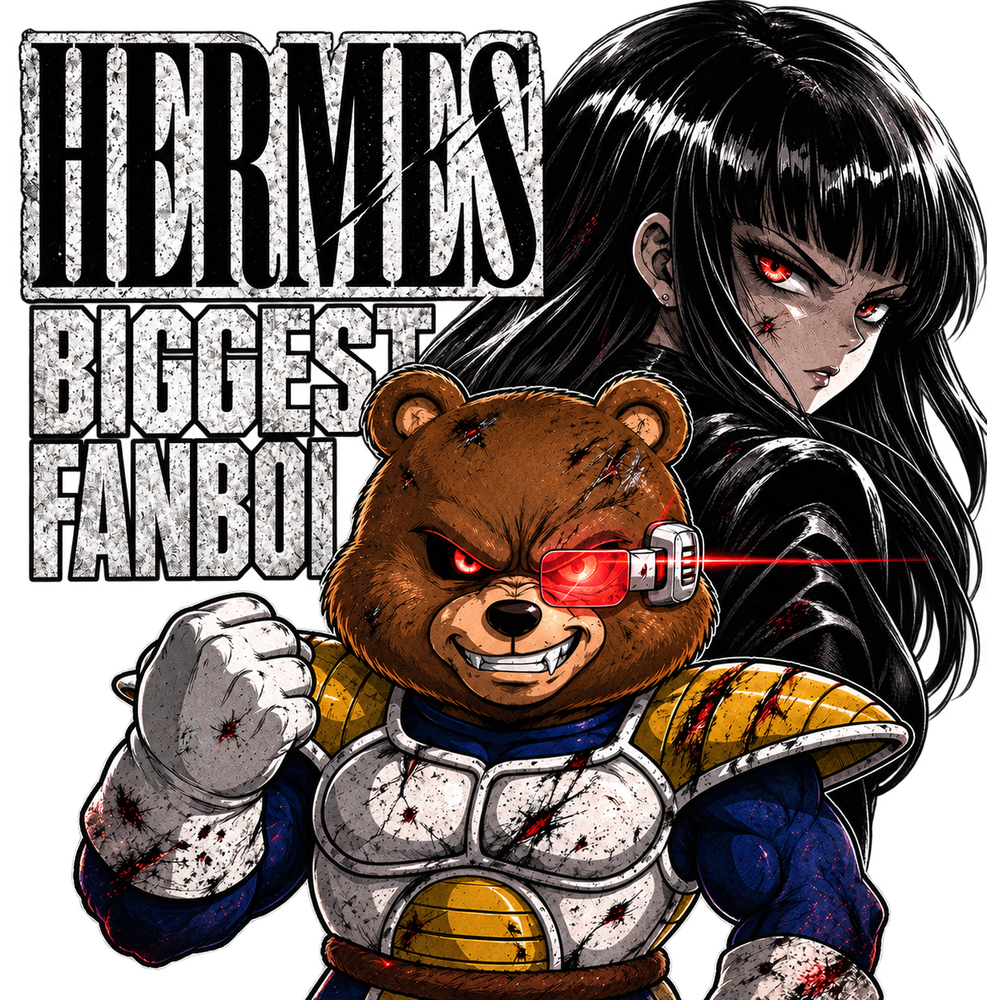

# Don Piedro

> **Community cameo — initial visual reference**

## Confirmed appearance

Don Piedro appears in [“Thank You Nous Research” by Arts Bro](../music-videos/thank-you-nous-research-arts-bro.md) at approximately **01:08**, in the middle of a nighttime go-kart race sequence.

### Visible design anchors

- Brown teddy-bear character
- White-and-Blue/Cobalt armored outfit with gold accents (Saiyan Prince Amromr)
- Red mechanical/visor-like eye piece
- Determined expression
- High-speed, anime-inspired presentation

## Scene context

Two community members race go-karts (Tunacookie and GottZ.) Don Piedro zooms through the scene; those two racers are left in the dust as Don Pedro zooms past them. 

## Deliberate unknowns

The archive does **not** yet establish Don Piedro’s role, affiliation, abilities, backstory, team membership, or detailed character-sheet design. Those details should be added only when confirmed.
