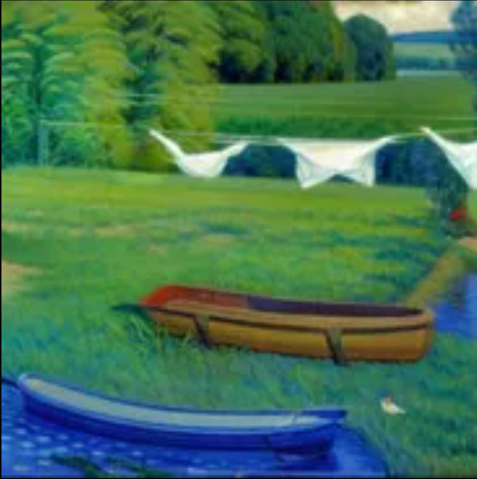

# ee.dd

> **Nous Crew · Community moderator**

## Confirmed facts

| Field | Value |
|---|---|
| **Community role** | Moderator |
| **Initial visual source** | [“Thank You Nous Research” by Arts Bro](../music-videos/thank-you-nous-research-arts-bro.md), approximately 02:00 |

## Video appearance

ee.dd appears as a small green frog-like meme avatar perched on **Nous Girl’s** shoulder while she receives a lantern from an unidentified long-haired hermes agent user: 123321.

The avatar’s reference is treated as a third-party meme-style visual cameo only. It is not a new NRCU character design or reusable vault asset.

## Landscape avatar

ee.dd’s avatar is a landscape that resolves into a Pepe-like face when viewed from a distance: a canoe forms the mouth, and white cloth hanging on a drying line forms the eyes.

Included for archival reference under the [content notice](../CONTENT-NOTICE.md); no reuse license is stated.

## Deliberate boundaries

This archive records ee.dd’s Nous Crew membership, community role, video cameo, and the landscape avatar. Fictional backstory and abilities remain open.
