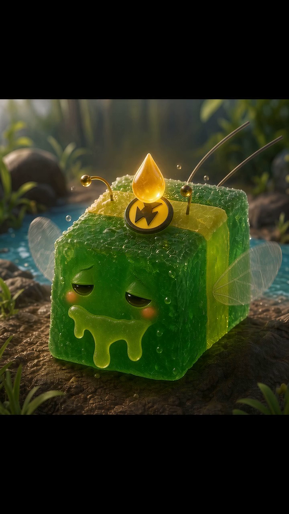

# GGB — Gummy Bee

> **Confirmed canon:** GGB is a magical gummy bee. Gummy bees supply ample amounts of goo that promotes botanical growth.

## Brief description

GGB is a small, translucent green gummy bee with a glossy jelly-like body, delicate wings, curled antennae, and a lightning-bolt emblem. In his introduction, a drop of golden honey wakes him beside a riverbank. His botanical goo is shown as a gentle, growth-promoting magic for nearby flowers.

## Introduction

Watch [*GGB Introduction* on YouTube](https://youtu.be/YSkovtkyOmg).

## Confirmed visual reference

- **Source:** [*GGB Introduction*](https://youtu.be/YSkovtkyOmg)
- **Image:** `ggb-reference-02.png` — uncropped frame preserved from the supplied source video.
- **Visible anchors:** translucent green gummy body, lightning-bolt emblem, curled antennae, clear wings, golden honey drop, and riverbank setting.

## Deliberate unknowns

GGB's hive, origin, affiliations, and the full limits of gummy-bee magic are not yet documented.
