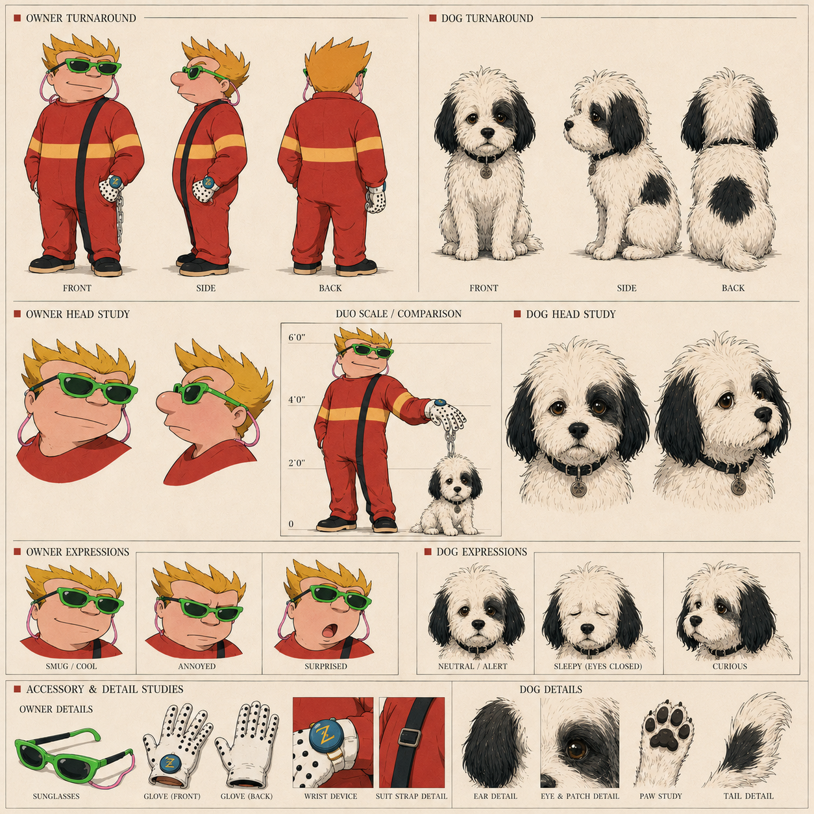

# I Sneeze Kittens

> **Community member — character reference and confirmed video appearance**

## Character reference

The supplied profile sheet depicts **I Sneeze Kittens** with his small black-and-white dog, **Moxie**. It includes front, side, and back turnarounds; head studies; a shared height scale; expressions; and accessory details.

### Visible design anchors — I Sneeze Kittens

- Large, angular golden-blond hair
- Thick bright-green sunglasses with dark lenses and a retaining cord
- Red full-body suit with wide mustard-yellow bands
- Black diagonal suit strap with a rectangular buckle
- Pale gloves with black grip dots
- Blue wrist device bearing a yellow angular emblem
- Black shoes with thick tan soles
- Silver-gray chain held in one gloved hand

The sheet labels his expressions **Smug / Cool**, **Annoyed**, and **Surprised**.

### Visible design anchors — Moxie

- Small, shaggy black-and-cream dog
- Long floppy black ears
- Amber-brown eyes with dark facial patches
- Black collar with a round tag
- Large dark patch across the back
- Fluffy curved tail

The sheet labels Moxie’s expressions **Neutral / Alert**, **Sleepy (Eyes Closed)**, and **Curious**.

## Confirmed video appearance

I Sneeze Kittens appears in [*Thank You Nous Research*](../music-videos/thank-you-nous-research-arts-bro.md), playing cards with **realtimeuk** around **00:33–00:35**.

## Reported details

- Described as snarky
- Likes dolphins
- His dog is named Moxie

## Sources

- Supplied I Sneeze Kittens character reference sheet
- [*Thank You Nous Research*](https://youtu.be/9RJHcYCGLmQ)
- [*I Sneeze Kittens*](https://youtu.be/8akpNknnhnA)
