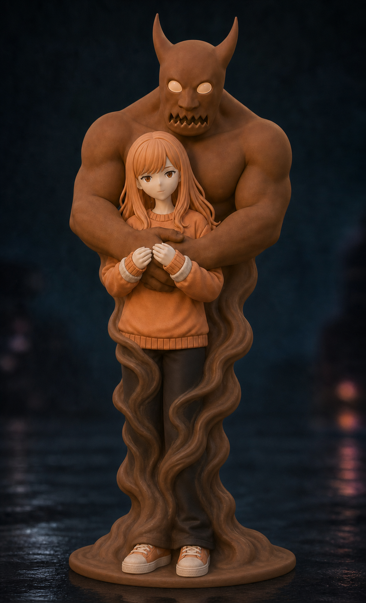

# Mephisto

**Browse group:** Founders

[View reference artwork](./sheets/mephisto.md) · [All characters](./README.md)

Mephisto is included in the NRCU Founders collection. The reference artwork shows a girl with long hair and an orange sweater, with a large horned clay monster behind her. The complete image is preserved as the primary visual reference.
