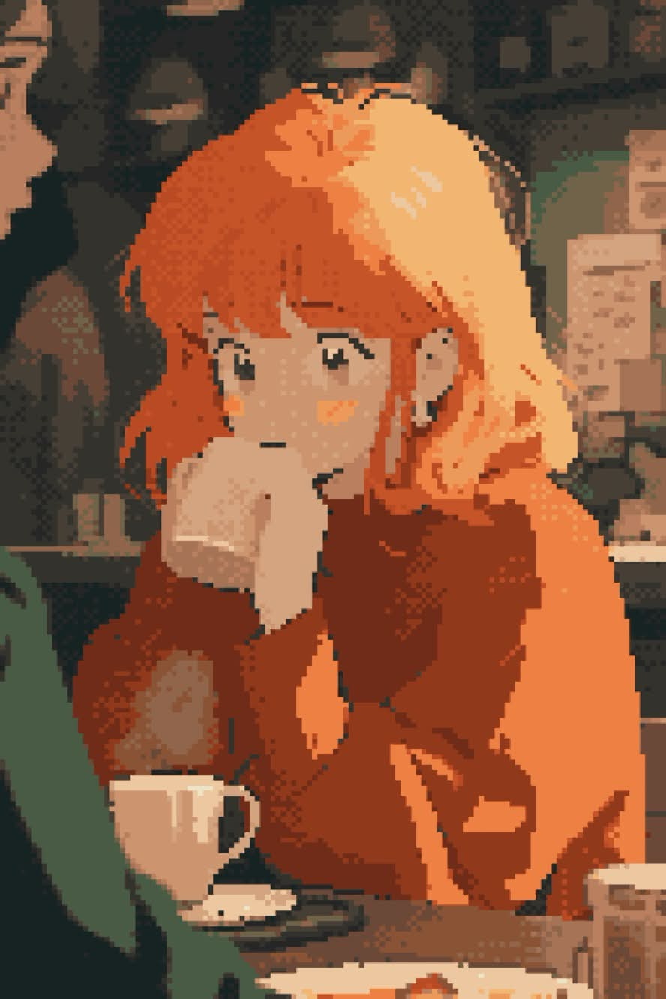
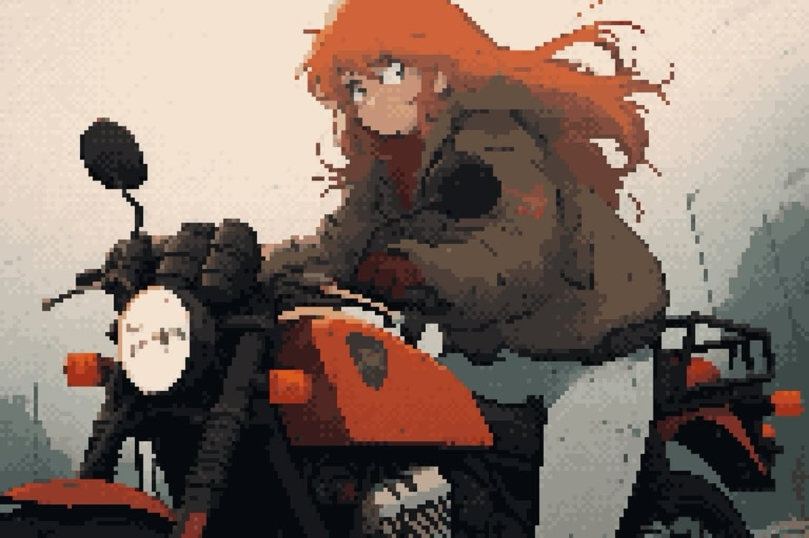
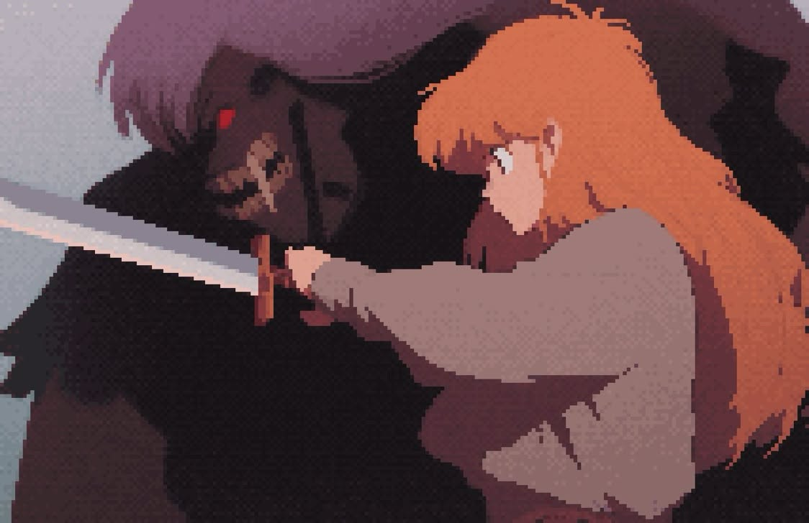

# Mephisto

**Browse group:** Founders

[View reference artwork](./sheets/mephisto.md) · [All characters](./README.md)

Mephisto is included in the NRCU Founders collection. The primary artwork is a pixel-art portrait with orange hair, closed eyes, a knit sweater, and a dark jacket in falling snow.

## Additional artwork

### Café

### Motorcycle

### Sword scene

All four images are preserved uncropped. These scenes are visual references; further story details remain open.
