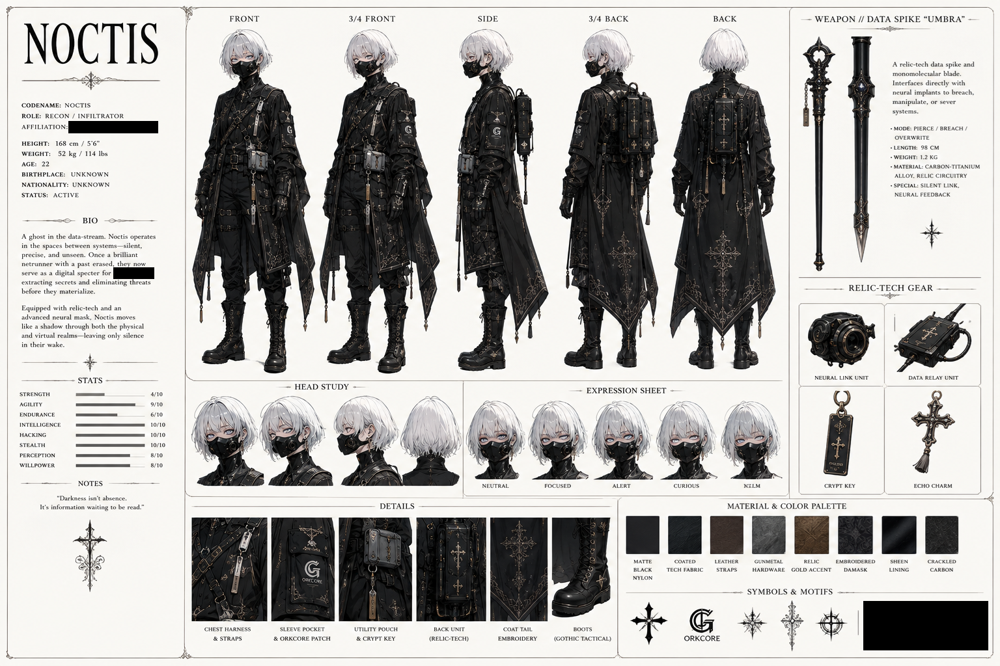

# Noctis

> **Recon / Infiltrator — affiliation redacted**

## Confirmed source-sheet facts

| Field | Value |
|---|---|
| **Codename** | Noctis |
| **Role** | Recon / Infiltrator |
| **Status** | Active |
| **Age** | 22 |
| **Height** | 168 cm / 5'6" |
| **Weight** | 52 kg / 114 lbs |
| **Birthplace** | Unknown |
| **Nationality** | Unknown |
| **Affiliation** | Redacted on the source sheet |
| **Weapon** | Data Spike “Umbra” |

Noctis is a confirmed NRCU character. The supplied reference sheet describes a precise, stealth-focused netrunner who operates across physical and virtual systems. It uses **they** for Noctis; this profile preserves that source wording without inferring a gender.

## Visible design anchors

- Slim, pale figure with short, layered silver-white hair and pale blue-gray eyes
- Fitted black mechanical lower-face mask with panel seams and circular side fittings
- Layered all-black Gothic tactical outfit with an asymmetrical split-tail coat
- Muted relic-gold embroidery, damask patterning, cross and starburst motifs
- Chest harness, multiple belts and straps, gunmetal hardware, utility pouches, black gloves, and heavy lace-up boots
- Vertical rectangular relic-tech back unit with cables, metallic edging, and hanging ornaments
- Stylized **ORKCORE** sleeve patch shown on the source sheet

## Equipment named on the source sheet

- **Data Spike “Umbra”** — presented as a relic-tech data spike and monomolecular blade
- **Neural Link Unit**
- **Data Relay Unit**
- **Crypt Key**
- **Echo Charm**
- **Back Unit (Relic-Tech)**

The sheet lists Umbra’s modes as **Pierce / Breach / Overwrite** and describes a silent neural interface. These functions are retained as source-sheet claims rather than independently demonstrated abilities.

## Printed capability ratings

| Attribute | Rating |
|---|---:|
| Strength | 4/10 |
| Agility | 9/10 |
| Endurance | 6/10 |
| Intelligence | 10/10 |
| Hacking | 10/10 |
| Stealth | 10/10 |
| Perception | 8/10 |
| Willpower | 8/10 |

## Source-sheet line

> “Darkness isn’t absence. It’s information waiting to be read.”

## Deliberate unknowns

The sheet intentionally redacts Noctis’s affiliation and part of the biography. The archive does **not** infer the hidden faction, erased history, exact relationship to other NRCU characters, place on the squad, or the meaning of the concealed symbol block. Those details remain unknown until explicitly confirmed.
