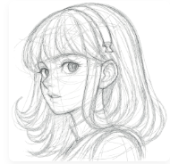
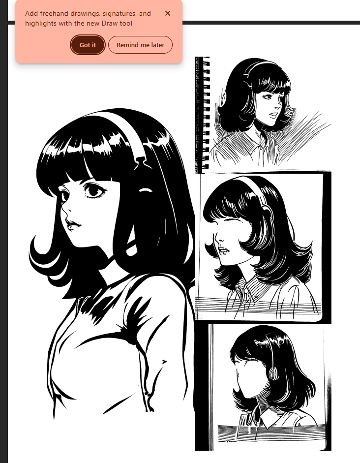
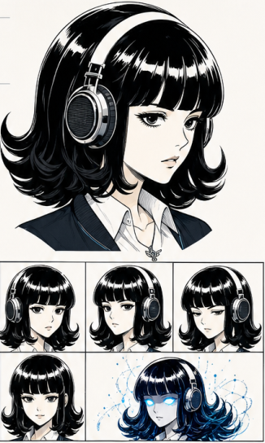

# Nous Girl

> **The girl from the Nous Research logo**

## Confirmed identity

When the archive owner refers to **Nous Girl**, he means the girl represented in the **Nous Research logo**. Nous Girl is not Heartbreaker/Brooklyn.

## Current character reference

The archive owner selected this neutral grayscale portrait as the current character reference for **Nous Girl**.

### Visible anchors

- Grayscale, pencil-style head-and-shoulders portrait
- Large expressive eyes and a slight smile
- Long, layered hair with bangs and a small hair detail near the crown
- Simple clothing contours against a plain background
- No combat, weaponry, or environmental scene is depicted

## Additional visual references

The archive owner also selected these as supplementary **Nous Girl** design references. They document visual possibilities without establishing additional lore.

### Ink concept studies

Four monochrome studies explore a glossy dark bob, a headband, collared clothing, and an over-ear earpiece. The drawing-tool notice visible in the supplied screenshot is preserved in the archive copy.

### Headphone and expression studies

This sheet shows a glossy black bob with straight bangs, large over-ear headphones, a white collared shirt beneath a dark sleeveless layer, a small pendant, and several expression studies. The final panel adds cyan eyes and abstract blue effects as a visual variation.

## Other confirmed appearance

Nous Girl appears around **02:00** in [*Thank You Nous Research* by Arts Bro](../music-videos/thank-you-nous-research-arts-bro.md), receiving a lantern from an unidentified long-haired figure. **ee.dd** appears as the small green frog-like meme avatar on her shoulder.

## Deliberate unknowns

- Nous Girl’s exact role, abilities, and wider NRCU chronology
- Whether the partial clothing visible in the portrait represents her standard outfit
- Which details in the supplementary studies are standard design features rather than exploratory variations
