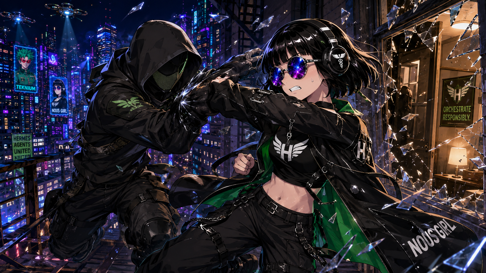

# Nous Girl

> **The girl from the Nous Research logo — open-source fighter**

## Confirmed identity

When the archive owner refers to **Nous Girl**, he means the girl represented in the **Nous Research logo**. Nous Girl is not Heartbreaker/Brooklyn.

## Confirmed scene

The archive owner identifies the woman in this scene as **Nous Girl**, fighting for open source against an **unidentified masked man**. The image does not establish the masked man’s identity, affiliation, or objective.

### Visible scene anchors

- Nous Girl has a short black bob with straight bangs.
- She wears large round glasses with vivid purple-blue-pink lenses and black over-ear headphones.
- Her black outfit has bright-green lining, numerous straps and buckles, and a white winged emblem.
- She meets the masked man’s attack at close range beside a shattered glass wall.
- The masked man wears a black hood, face covering, gloves, tactical layers, and utility gear.
- Drones cast blue beams across a neon-lit futuristic city.
- Visible environmental text includes **TEKNIUM**, **NOUS GIRL**, **HERMES AGENTS UNITED**, and **ORCHESTRATE RESPONSIBLY.**

## Other confirmed appearance

Nous Girl appears around **02:00** in [*Thank You Nous Research* by Arts Bro](../music-videos/thank-you-nous-research-arts-bro.md), receiving a lantern from an unidentified long-haired figure. **ee.dd** appears as the small green frog-like meme avatar on her shoulder.

## Deliberate unknowns

- The masked man’s identity and affiliation
- Where this confrontation falls in NRCU chronology
- The cause and outcome of the fight
- Whether the action-scene outfit is Nous Girl’s standard clothing or specific to this scene
