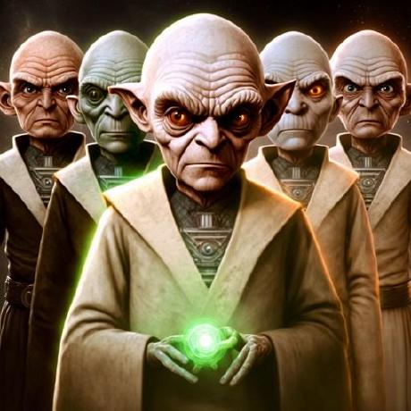
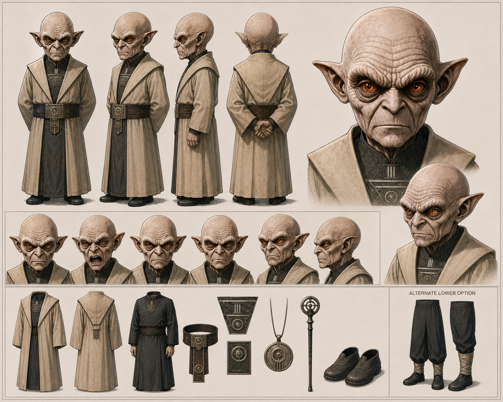

# quark2world

> **Quark — community creator and NRCU character**

## Approved character sheet

This is Quark’s approved NRCU character design. The full sheet is preserved intact, including turnarounds, facial studies, clothing, accessories, and an alternate lower-body option.

### Visible sheet design anchors

- Bald head, deeply lined pale skin, pointed ears, and amber eyes
- Long beige outer coat over a dark, patterned high-collared robe
- Wide dark belt with circular metallic detailing and a hanging front ornament
- Coordinated circular motifs on the chest ornament, pendant, and staff
- Dark shoes; an alternate trouser option with wrapped lower legs

The sheet establishes visual design; the accessories do not establish powers or a narrative role.

## Confirmed appearance

Mike identifies the figure in [“Thank You Nous Research” by Arts Bro](../music-videos/thank-you-nous-research-arts-bro.md) at approximately **02:09** as **quark2world**. The figure operates a large industrial machine in a workshop setting.

### Visible design anchors

- Bald, pointed-eared humanoid figure
- Pale work coat / jacket
- Large industrial mechanism with copper-toned fittings, hand wheel, and indicator lights

## Creator profile

Quark is a Europe-based community creator who makes music and videos, runs a YouTube channel, and builds creative and game-development tools. He works with a powerful personal computer; specific hardware specifications are not documented here.

### NRCU game contributions

- Created the hitbox and hurtbox lab.
- Contributed the experimental NRCU Platform Fighter work associated with [PR #2](https://github.com/123mikeyd/nrcu-platform-fighter/pull/2), including the Teknium / TurboFit experimental preview.
- **Quark’s Battle Lab** is Mike’s intended Quark-themed postgame bonus: an experimental playground unlocked after completing Story Mode, with hitbox, hurtbox, movement-box, and barrier editing. This records the intended design, not a claim that the unlock is implemented.

### Music and video work

Quark creates music and videos on his YouTube channel, [amglolification](https://www.youtube.com/@amglolification).

- **“One More Prompt”** — song by Quark; see [Tekpunk — One More Prompt | Hackathon Fuel](../music-videos/tekpunk-one-more-prompt.md).
- **[“Never Catch My Face”](https://youtu.be/yau5rWIwx5Q?si=I9jslgnclH1Pd8Dc)** — song by Quark. [Hermes SR72](../music-videos/hermes-sr72.md) used half of this song.
- Creates videos featuring **Nous Girl**, the woman from the Nous Research logo, **Teknium**, and **[Turbofit](./turbo-fit.md)**, the NRCU character for Sovthpaw.

### Community contributions

Quark is helpful in the community Discord. He also helped identify community appearances in the Arts Bro video, including Adolan, Tunacookie, GottZ, and Shawn Cleta. This contribution is separate from his own documented on-screen appearance.

## Public project connection

Official Hermes documentation credits **@quark2world** with custom skins for the [HermelinChat GUI](https://github.com/quarker1337/hermelinChat).

The public YouTube channel [amglolification](https://www.youtube.com/@amglolification) hosts both a HermelinChat video and [“Tekpunk — One More Prompt | Hackathon Fuel”](../music-videos/tekpunk-one-more-prompt.md). This is Quark’s confirmed channel.

## Open character lore

Quark’s approved visual design, creative work, and game contributions are established separately from fictional lore. His NRCU in-universe title, affiliation, abilities, team membership, and detailed backstory remain open.
