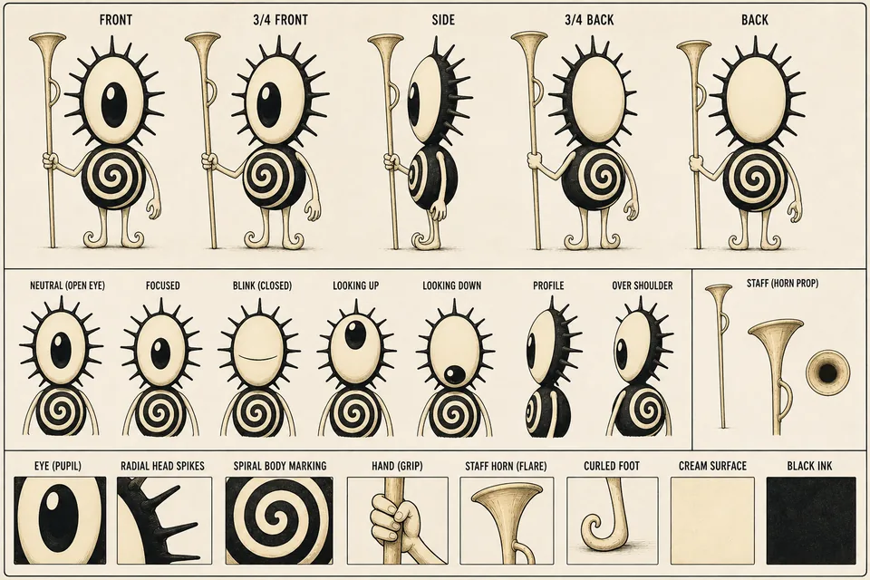
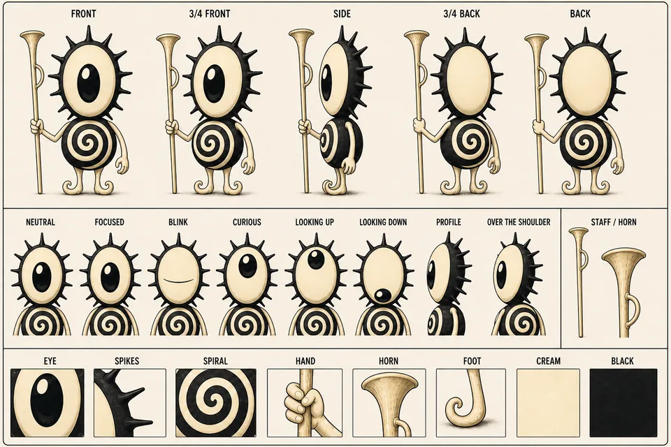
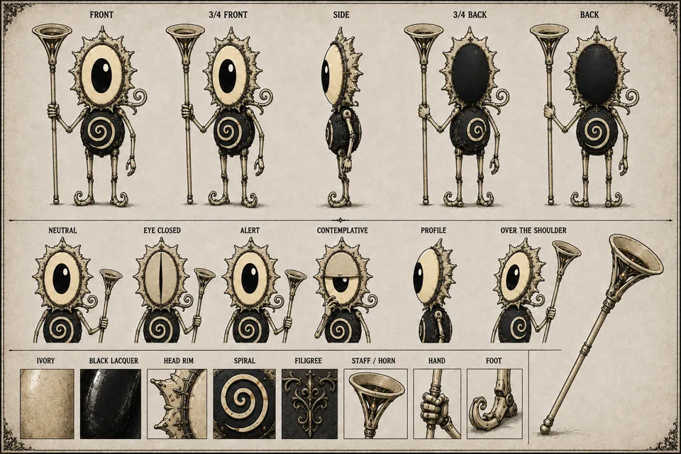
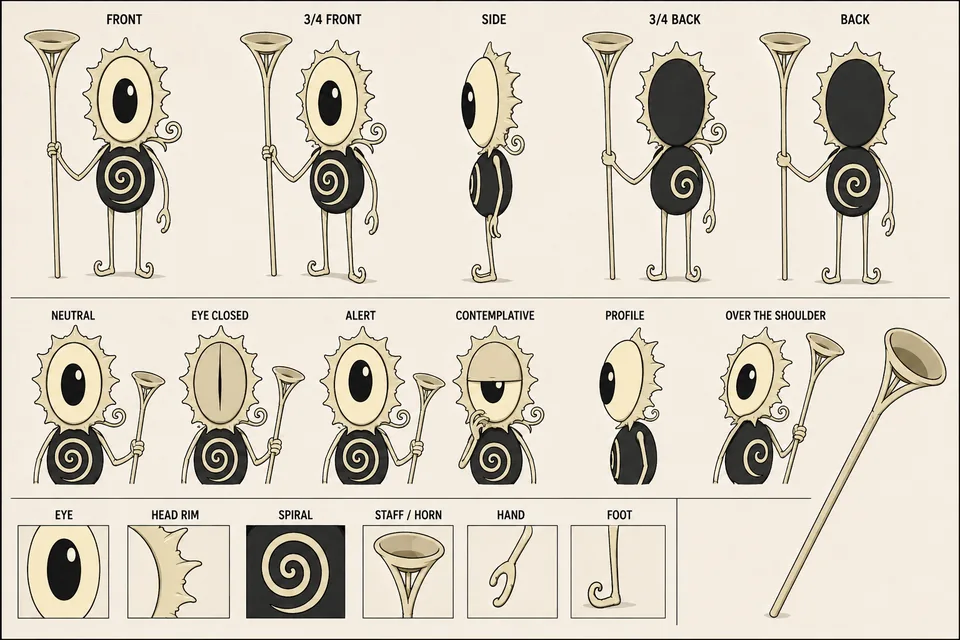

# adolan — Character Sheets

[Character profile](../adolan.md) · [All characters](../README.md) · [Visual library](../../library/index.html)

Supplementary character art from [Sahil’s Hermes Multiverse collection](https://github.com/Sahil-SS9/hermes-multiverse). Existing primary references and character lore remain unchanged. Printed sheet details describe that interpretation, not automatic affiliation or biography.

## Anime

## Chibi

## Claymation Stop Motion

## Disney

## Gothic

## Hyper Realistic

## Ink Pen Sketch

## Mecha

## Rick And Morty

## Full-resolution originals

[Source full-resolution release ZIP](https://github.com/Sahil-SS9/hermes-multiverse/releases/download/v0.2.0-wip/hermes-multiverse-v0.2.0-wip-full-resolution.zip). The smaller WebP copies above are for browsing. The [content notice](../../CONTENT-NOTICE.md) applies.
