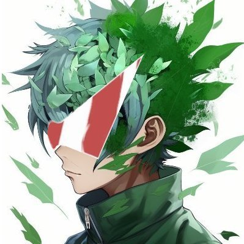

# ⚡ Teknium

## Core Stats

| Attribute | Value |
|-----------|-------|
| **Role** | Head Honcho — Leader / Architect |
| **Weapon** | Hermes Command Staff |
| **Allegiance** | Nous Research |
| **Signature Item** | Hermes Command Staff |

## Focus

Systems, Strategy, Growth

## Overview

> The leader and architect of the Hermes Agent Squad. Teknium is depicted with the Hermes Command Staff and a glowing tablet of schematics and strategies.

## Design Notes

Teknium is the squad's green-haired leader. His spiky hair carries visible leafage, and he wears one connected sheet of triangular shades — never a mask, visor, or eye glow. He wears a dark-green tactical-style jacket with "NR" patches on the shoulders and carries the Hermes Command Staff alongside a glowing tablet of green schematics and maps.

## Key Appearances

- **Campfire Scene:** Central figure holding the Command Staff and glowing tablet, roasting marshmallows
- **Carnival Party:** Pointing forward with a confident grin, tablet in hand
- **Beach Finale:** Holding the glowing staff, smiling toward the team
- **ASK HERMES:** Pointing toward the "ASK HERMES" panel, gesturing toward truth

## Signature Items

- **Hermes Command Staff:** A tall staff associated with the squad
- **Glowing Tablet:** Displays green schematics, maps, and strategic data
- **NR Patches:** Nous Research insignia on jacket shoulders
