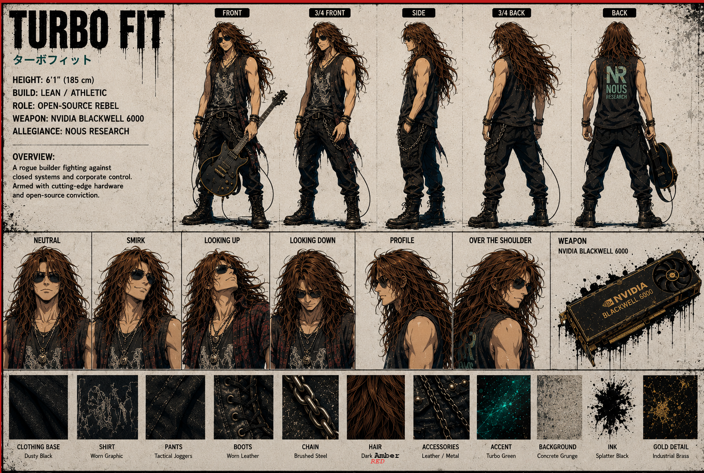

# 🎸 Turbo Fit (ターボフィット)

## Core Stats

| Attribute | Value |
|-----------|-------|
| **Height** | 6'1" (185 cm) |
| **Build** | Lean / Athletic |
| **Role** | Open-Source Rebel — Fighter / Builder |
| **Community name** | Sovthpaw (identified by Mike in the “Thank You Nous Research” video) |
| **Weapon** | NVIDIA Blackwell 6000 |
| **Allegiance** | Nous Research |
| **Signature Item** | Bass Guitar |

## Focus

Performance, Hardware, Open-Source Advocacy

## Overview

> A rogue builder fighting against closed systems and corporate control. Armed with cutting-edge hardware and open-source conviction.

## Material & Texture Guide

| Material | Description |
|----------|-------------|
| Clothing Base | Dusty Black |
| Shirt | Worn Graphic |
| Pants | Tactical Joggers |
| Boots | Worn Leather |
| Chain | Brushed Steel |
| Hair | Dark Brown |
| Accessories | Leather / Metal |
| Accent | Turbo Green |
| Background | Concrete Grunge |
| Ink | Splatter Black |
| Gold Detail | Industrial Brass |

## Character Reference Sheet Views

- Front, 3/4 Front, Side, 3/4 Back, Back
- Expressions: Neutral, Smirk, Looking Up, Looking Down, Profile, Over the Shoulder
- Weapon Reference: NVIDIA Blackwell 6000

## Video appearance — Thank You Nous Research

Around **02:40**, Sovthpaw / Turbo Fit appears in a small home workspace with a teepee-like hut and a chalkboard, working to keep track of everything. Mike describes the scene as an unfazed, persistent effort to keep going despite the scale of the work.

## Design Notes

Turbo Fit is the squad's rock-and-roll hardware hacker. Long messy dark brown wavy hair, dark sunglasses, punk/grunge styling — sleeveless worn graphic shirt, tactical joggers, leather/metal accessories, boots, with a bass guitar slung over his back. The "NR" (Nous Research) logo appears on the back of his shirt. His "weapon" is a high-end NVIDIA Blackwell 6000 graphics card — a fitting symbol for a tech builder who fights with open-source conviction.
