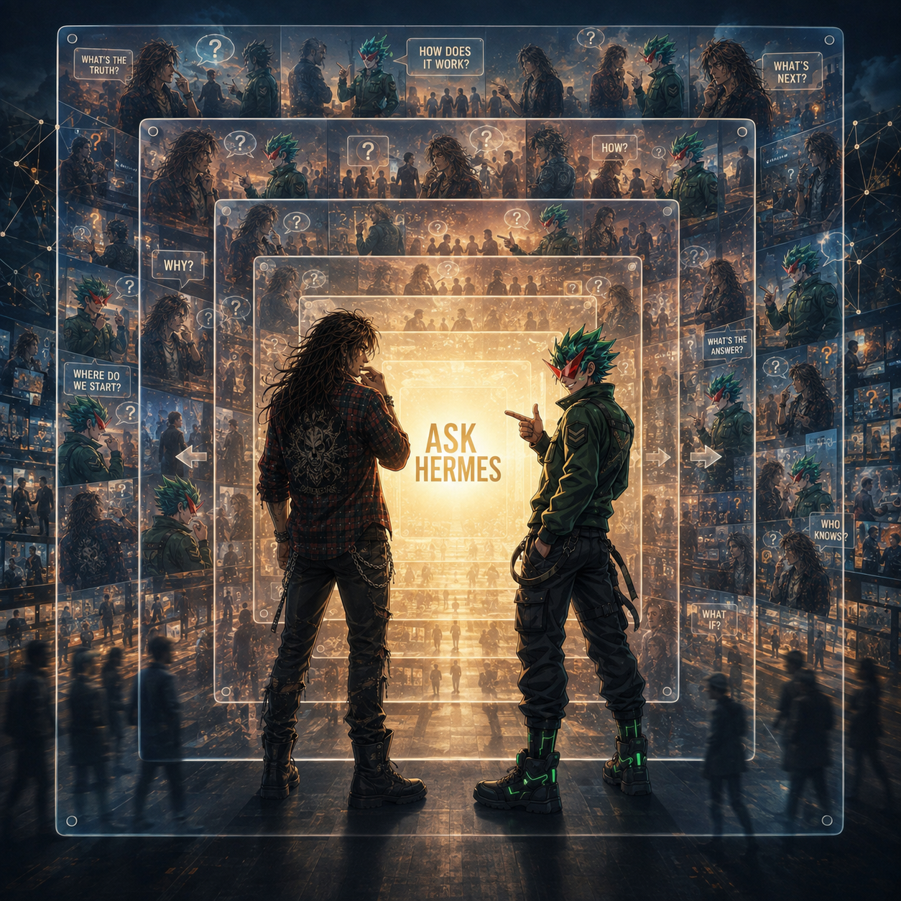

# 🌆 ASK HERMES

## Scene Description

Two characters — Turbo Fit and Teknium — stand back-to-back before a massive, glowing central panel reading **"ASK HERMES"** in a cyberpunk cityscape. The panel emits an intense golden-white light, resembling a digital billboard, server bank, or portal.

### The Characters

- **Turbo Fit (left):** Shoulder-length wavy dark brown hair, scruffy beard, hand raised near his mouth in contemplation. Red and black plaid flannel open over his chest, ripped jeans, combat boots. A silver chain at his waist. Bohemian rock-and-roll aesthetic contrasting the high-tech setting.
- **Teknium (right):** Spiky bright green hair, red mask/bandana covering his lower face, pointing forward toward the panel. Dark green tactical jacket with sergeant chevron, black cargo pants with straps and buckles, boots with glowing green neon LED strips. Futuristic soldier/cyber-operative.

### The Questions

Floating speech bubbles surround the panel — the fundamental questions of existence:

- "WHAT'S THE TRUTH?"
- "HOW DOES IT WORK?"
- "WHAT'S NEXT?"
- "WHY?"
- "HOW?"
- "WHERE DO WE START?"
- "WHAT'S THE ANSWER?"
- "WHO KNOWS?"
- "WHAT IF?"

### The Memory Wall

The background is a grid of translucent rectangular frames containing miniature scenes of the two characters — interacting with crowds, standing in urban environments, looking mysterious. A hall of mirrors / data-stream effect suggesting their actions are recorded, analyzed, and replayed. Faint glowing constellation/neural network lines connect in the corners.

Silhouettes of people walk in a city street at the bottom, grounding the scene in a public urban space.

## Art Style

Anime/cyberpunk. Cool blue ambient lighting contrasted with the warm golden glow of the ASK HERMES panel. Layered, complex composition with depth from the memory-wall grid. Neon, data streams, military tech, gritty urban atmosphere.

## Thematic Meaning

The scene portrays a moment of seeking truth. Turbo Fit (representing chaos/art) and Teknium (representing order/strategy) are united in consulting Hermes — an AI, oracle, or search engine that holds all answers. The speech bubbles represent the fundamental questions of the people, fed into the system. The memory wall implies that every question and answer becomes part of the eternal record.

In the NRCU, Hermes is both the messenger and the message — the bridge between human curiosity and cosmic knowledge.
