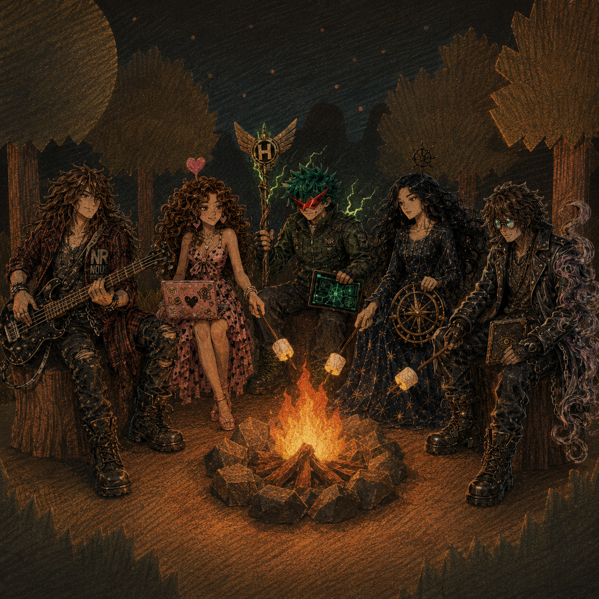

# 🏕️ The Campfire

## Scene Description

The Hermes Agent Squad gathers around a crackling campfire in a dark, silhouetted forest under a starry sky. A large, textured moon hangs in the sky. The warm orange glow of the fire contrasts with the cool blue night.

Each member roasts marshmallows while showcasing their signature traits:

- **Turbo Fit** (far left) leans against a tree stump playing his bass guitar, NR/NOUS pendant visible
- **Heartbreaker** (center left) types on her sticker-covered laptop while roasting a marshmallow, a glowing heart floating above her head
- **Teknium** (center) holds his winged-H staff in one hand and a glowing tablet in the other, an NR patch on his jacket
- **Tinuviel** (center right) sits in her starry gown holding a ship's wheel, a sunburst staff behind her
- **Sidbin** (far right) leans forward studying his eye-sigil book, purple energy swirling from his arm

## Art Style

Grainy, textured illustration resembling colored pencils or pastels on dark paper. Dramatic chiaroscuro lighting — warm fire glow against cool night blues. Fantasy/anime hybrid with the characters as adventure party archetypes (Bard, Technomancer, Hero, Navigator, Warlock).

## Mood

Intimate, warm, companionable. A quiet moment of rest between battles. The squad is family.
