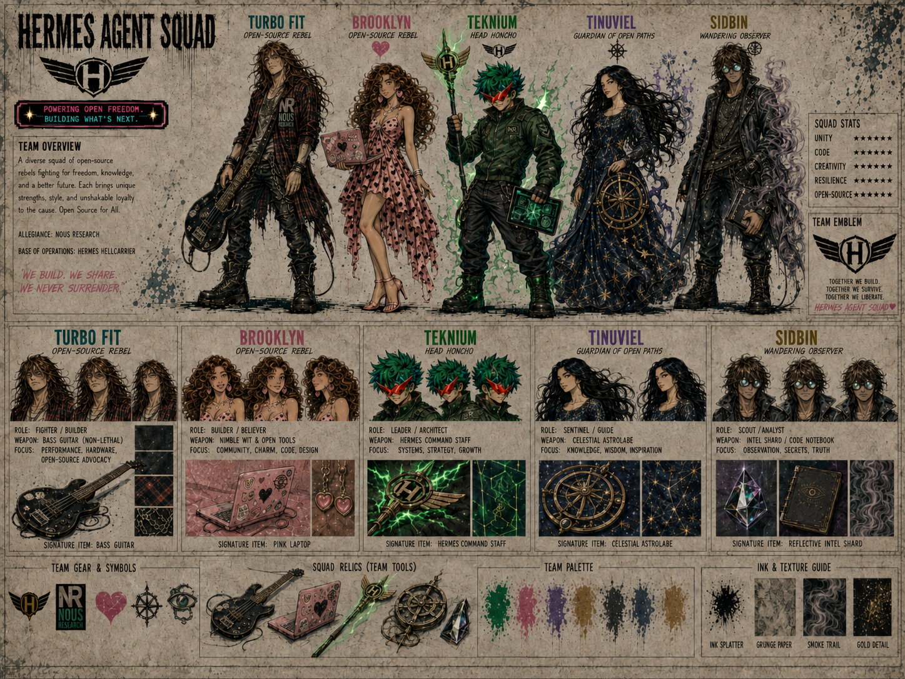

# 🛡️ Hermes Agent Squad —

## Team Overview

> A diverse squad of open-source rebels fighting for freedom, knowledge, and a better future. Each brings unique strengths, style, and unshakable loyalty to the cause. Open Source for All.

| Field | Value |
|-------|-------|
| **Allegiance** | Nous Research |
| **Base of Operations** | Hermes Hellcarrier |
| **Motto** | We Build. We Share. We Never Surrender. |
| **Tagline** | Powering Open Freedom. Building What's Next. |
| **Team Emblem** | Winged H |

## Squad Stats

| Stat | Rating |
|------|--------|
| Unity | ★★★★★ |
| Code | ★★★★★ |
| Creativity | ★★★★★ |
| Resilience | ★★★★★ |
| Open-Source | ★★★★★ |

## Team Manifesto

> *Together we build. Together we survive. Together we liberate.*

---

## Members

### 🎸 Turbo Fit
- **Title:** Open-Source Rebel
- **Role:** Fighter / Builder
- **Weapon:** Bass Guitar (Non-Lethal) / NVIDIA Blackwell 6000
- **Focus:** Performance, Hardware, Open-Source Advocacy
- **Signature Item:** Bass Guitar
- **Allegiance:** Nous Research
- [Full Profile →](../characters/turbo-fit.md)

### 💕 Brooklyn (Heartbreaker)
- **Title:** Open-Source Rebel
- **Role:** Builder / Believer
- **Weapon:** Nimble Wit & Open Tools
- **Focus:** Community, Charm, Code, Design
- **Signature Item:** Pink Laptop
- **Allegiance:** Nous Research
- [Full Profile →](../characters/heartbreaker.md)

### ⚡ Teknium
- **Title:** Head Honcho
- **Role:** Leader / Architect
- **Weapon:** Hermes Command Staff
- **Focus:** Systems, Strategy, Growth
- **Signature Item:** Hermes Command Staff
- **Allegiance:** Nous Research
- [Full Profile →](../characters/teknium.md)

### 🛻 Gille
- **Role:** Support
- **Focus:** Support Threads
- **Initial Visual References:** Driving a compact olive-green utility truck at approximately 00:29, then bringing a red insulated coffee thermos to an unidentified coffee-machine-like figure at approximately 00:37–00:39 in [“Thank You Nous Research”](../music-videos/thank-you-nous-research-arts-bro.md)
- **Known Details:** Gille handles support threads; further lore and design details remain unconfirmed.
- [Minimal Profile →](../characters/gille.md)

### ✨ Tinuviel (The Starry Wanderer)
- **Title:** Guardian of Open Paths
- **Role:** Sentinel / Guide
- **Weapon:** None (Wields Influence) / Celestial Astrolabe
- **Focus:** Knowledge, Wisdom, Inspiration
- **Signature Item:** Celestial Astrolabe
- **Allegiance:** Open Source Alliance
- [Full Profile →](../characters/tinuviel.md)

### 👁️ Sidbin (Mirror Shade)
- **Title:** Wandering Observer
- **Role:** Scout / Analyst
- **Weapon:** None (Carries Secrets) / Intel Shard / Code Notebook
- **Focus:** Observation, Secrets, Truth
- **Signature Item:** Reflective Intel Shard
- **Allegiance:** ⚠️ **Unknown**
- [Full Profile →](../characters/sidbin.md)

---

## Team Gear & Symbols

- **Winged H Emblem** — The squad's insignia, featured on staff, signs, and branding
- **NR / Nous Research Logo** — The organizational allegiance
- **Heart Icon** — Heartbreaker's symbol
- **Eye Icon** — Sidbin's symbol
- **Sun/Star Icon** — Tinuviel's symbol
- **Guitar Pick Icon** — Turbo Fit's symbol

## Squad Relics (Team Tools)

The squad's shared arsenal of artifacts and tools, passed between members as needed:
- Hermes Command Staff (winged-H emblem)
- Celestial Astrolabe (navigation artifact)
- Reflective Intel Shard (truth-revealing relic)
- Pink Laptop (open-source toolkit)
- Bass Guitar (non-lethal, morale-boosting)

## Team Palette & Texture Guide

| Element | Description |
|---------|-------------|
| Ink Splatter | Black ink texture used across all sheets |
| Grunge Paper | Aged/worn paper background texture |
| Smoke Trail | Ethereal smoke effect (teal/mauve/lavender) |
| Gold Detail | Antique brass / industrial gold accents |

---

*WE BUILD. WE SHARE. WE NEVER SURRENDER.* ❤️
